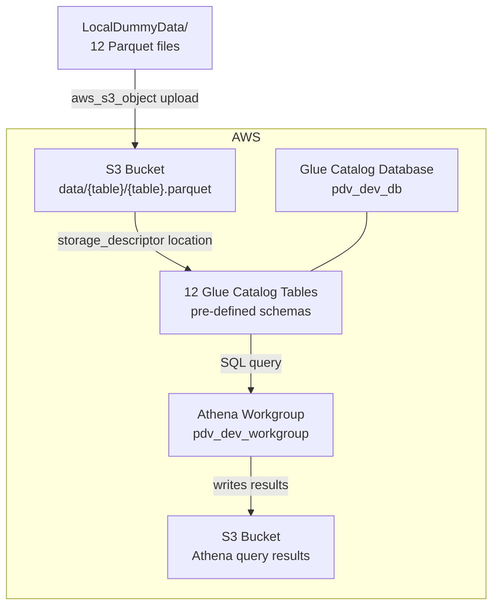

# Terraform-AWS-S3-Glue-Athena-Example

A Terraform example that provisions a simple data lake on AWS for running SQL queries over Brazilian retail POS (Point of Sale) data.

## Architecture



## Resources Created

| Resource | Description |
|----------|-------------|
| **S3 Bucket (data)** | Stores the 12 Parquet files organized by table |
| **S3 Bucket (results)** | Stores Athena query results |
| **Glue Catalog Database** | Database in the Glue Data Catalog |
| **12 Glue Catalog Tables** | Tables with pre-defined schemas pointing to the Parquet files in S3 |
| **Athena Workgroup** | Workgroup to run SQL queries over the data |

## Sample Data

The 12 Parquet files in `LocalDummyData/` model a Brazilian retail POS system:

| Table | Description | Rows |
|-------|-------------|------|
| lojas | Stores / branches | 3 |
| caixas | Cash registers per store | 9 |
| operadores | Cashier operators | 12 |
| categorias | Product categories | 6 |
| produtos | Product catalog | 50 |
| clientes | Registered customers | 15 |
| formas_pagamento | Accepted payment methods | 4 |
| sessoes_caixa | Cash register open/close sessions | 810 |
| vendas | Sales transactions | 2,500 |
| itens_venda | Line items per sale | 9,762 |
| pagamentos_venda | Payments per sale | 2,431 |
| movimentacoes_caixa | Cash withdrawals and deposits | 43 |

## Prerequisites

1. **Terraform** >= 1.0 installed ([download](https://developer.hashicorp.com/terraform/downloads))
2. **AWS CLI** configured with valid credentials:
   ```bash
   aws configure
   ```
3. IAM permissions to create **S3**, **Glue**, and **Athena** resources

## Usage

```bash
cd AWS+Glue+Athena/infra

terraform init
terraform plan
terraform apply

# When done testing, tear everything down
terraform destroy
```

## Testing with Athena

After `terraform apply`, open the [Athena console](https://console.aws.amazon.com/athena) and:

1. Select the `pdv_dev_workgroup` workgroup
2. Select the `pdv_dev_db` database in the left panel
3. Run SQL queries, for example:

```sql
-- Total sales per store
SELECT l.nome AS store, COUNT(v.id) AS total_sales, SUM(v.valor_total) AS revenue
FROM vendas v
JOIN sessoes_caixa sc ON v.sessao_caixa_id = sc.id
JOIN caixas c ON sc.caixa_id = c.id
JOIN lojas l ON c.loja_id = l.id
GROUP BY l.nome
ORDER BY revenue DESC;
```

```sql
-- Top 10 best-selling products
SELECT p.nome, SUM(iv.quantidade) AS qty_sold, SUM(iv.subtotal) AS total
FROM itens_venda iv
JOIN produtos p ON iv.produto_id = p.id
GROUP BY p.nome
ORDER BY qty_sold DESC
LIMIT 10;
```

```sql
-- Revenue by payment method
SELECT fp.nome AS payment_method, COUNT(*) AS transactions, SUM(pv.valor_pago) AS total
FROM pagamentos_venda pv
JOIN formas_pagamento fp ON pv.forma_pagamento_id = fp.id
GROUP BY fp.nome
ORDER BY total DESC;
```

## Terraform File Structure

All `.tf` files live inside `infra/`:

| File | Contents |
|------|----------|
| `infra/main.tf` | AWS provider and required_providers |
| `infra/variables.tf` | Input variables (project_name, region, environment) |
| `infra/s3.tf` | S3 buckets and Parquet file uploads |
| `infra/glue.tf` | Glue Database, schemas, and Catalog Tables |
| `infra/athena.tf` | Athena Workgroup |
| `infra/outputs.tf` | Outputs (created resource names) |
| `infra/terraform.tfvars` | Variable values |

## Variables

| Variable | Default | Description |
|----------|---------|-------------|
| `project_name` | `pdv` | Prefix for resource names |
| `aws_region` | `us-east-1` | AWS region |
| `environment` | `dev` | Environment (dev, staging, prod) |
